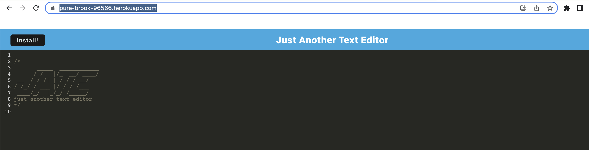
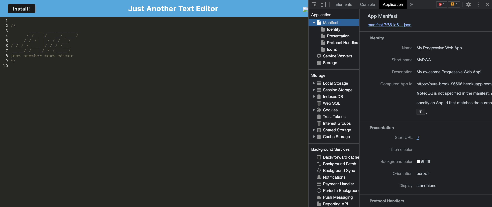

# PWA-Text-Editor
Challenge 19

[deployed application](https://pure-brook-96566.herokuapp.com/)
    
## Description
    
This is a text editor that runs in a browser. This app is a single-page application that meets the PWA criteria. Additionally, it features a number of data persistence techniques taht server as redundancy in case one of the options is not supported by the browser. This application also functions offline. 

I stared with an existing application and implemented methods for getting and storing data to an IndexedDB database. I used a package called 'idb', which is a lightweight wrapper around the IndexedDB API. 
    
## Table of Contents
    
- [Installation](#installation)
- [Usage](#usage)
- [License](#license)
- [Contributing](#how-to-contribute)
- [Questions](#questions)
    

## Installation
    
How to install dependancies: npm i
    

## Usage
    
GIVEN a text editor web application

WHEN I open my application in my editor

THEN I should see a client server folder structure

WHEN I run `npm run start` from the root directory

THEN I find that my application should start up the backend and serve the client

WHEN I run the text editor application from my terminal

THEN I find that my JavaScript files have been bundled using webpack

WHEN I run my webpack plugins

THEN I find that I have a generated HTML file, service worker, and a manifest file

WHEN I use next-gen JavaScript in my application

THEN I find that the text editor still functions in the browser without errors

WHEN I open the text editor

THEN I find that IndexedDB has immediately created a database storage

WHEN I enter content and subsequently click off of the DOM window

THEN I find that the content in the text editor has been saved with IndexedDB

WHEN I reopen the text editor after closing it

THEN I find that the content in the text editor has been retrieved from our IndexedDB

WHEN I click on the Install button

THEN I download my web application as an icon on my desktop

WHEN I load my web application

THEN I should have a registered service worker using workbox

WHEN I register a service worker

THEN I should have my static assets pre cached upon loading along with subsequent pages and static assets

WHEN I deploy to Heroku

THEN I should have proper build scripts for a webpack application
    

## License
            
This repo has the MIT license.
    

## How to Contribute
    
Contributor Covenant v2.1
    

## Questions
    
For questions check out my GitHub profile [allisonnault](https://www.github.com/allisonnault)

Or you can email me at [allisonrnault@gmail.com](mailto:allisonrnault@gmail.com)

